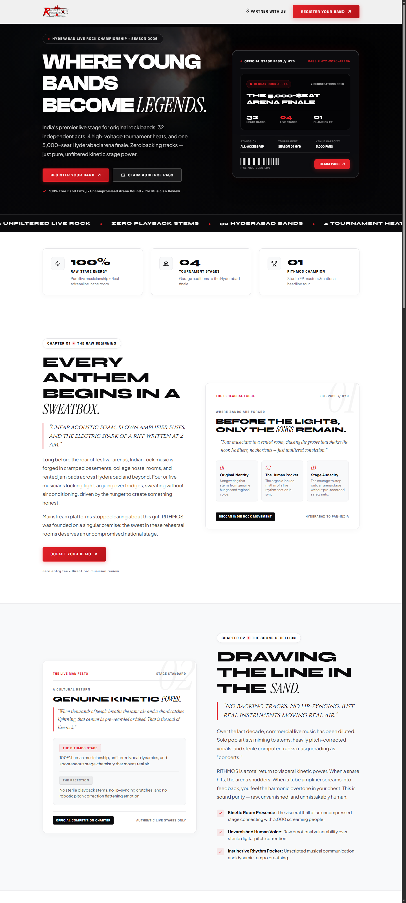

# RITHMOS — Where Young Bands Become Legends

India’s premier live stage and tournament platform for original indie rock bands. 32 independent acts, 4 high-voltage tournament heats, and one 5,000-seat Hyderabad arena finale. Zero backing tracks, zero pre-recorded stems — pure, unfiltered kinetic stage power.

## ⚡ Features

- **High-Culture Editorial Design System**: Minimalist high-contrast palette (White & Architectural Black with 5% Surgical Red accents) featuring bold geometric display sans (Syne) paired with razor-sharp editorial italics (Instrument Serif).
- **Interactive 3D Holographic Arena VIP Pass**: Tactile 3D perspective tilt physics (perspective(1000px) rotateX(...) rotateY(...)) with dynamic holographic foil reflection responding to cursor movement.
- **Cinematic Stage Hero**: Live stage performance video letterboxed with directional scrims ensuring crystal-clear text readability alongside vibrant concert lighting.
- **Kinetic Marquee Ticker Tape**: 60fps infinite hardware-accelerated ticker tape delivering tournament momentum above the fold.
- **Tournament Stage Architecture**: 4-stage progression tracking (Garage Demos → Club Heats → Regional Arena Semifinals → 5,000-Seat Grand Arena Finale).
- **Interactive Modals**: Direct applications for Band Registration, VIP Stage Passes, and Brand Partnerships.
- **Zero Heavy Framework Dependencies**: 100% lightweight vanilla HTML5, CSS3, and modern JavaScript.

## 🚀 Quick Start

1. **Clone the repository:**
   `ash
   git clone https://github.com/SamLeo-07/rithmos-simple.git
   cd rithmos-simple
   `

2. **Start the local streaming server:**
   `ash
   node serve.js
   `

3. **Open in browser:**
   Navigate to [http://localhost:8006](http://localhost:8006).

## 📁 Project Structure

`
├── index.html          # Main semantic landing page markup
├── styles.css          # Design system, typography, animations, responsive layout
├── app.js              # 3D pass tilt, scroll progress, modals, reveal observers
├── serve.js            # Node HTTP static & video range streaming server
├── screenshot.js       # Headless Chrome visual verification tool
├── hero-clip.mp4       # Background live concert video
├── rithmos-logo.png    # Official RITHMOS brand emblem
└── package.json        # Project metadata & dependencies
`

## 📜 License

&copy; 2026 RITHMOS Live Music Properties. All rights reserved.
